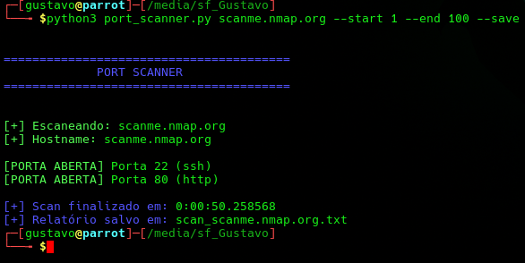
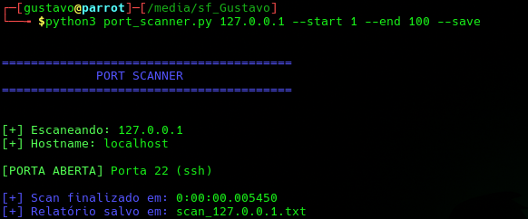

# 🔎 Port Scanner (Python)

Ferramenta desenvolvida em Python para escaneamento de portas TCP, identificação de serviços e geração de relatórios.

Projeto voltado para estudos de redes, reconhecimento de infraestrutura e fundamentos de segurança ofensiva.

---

# 📌 Funcionalidades

* 🔍 Escaneamento de portas TCP
* 🌐 Identificação de serviços expostos
* ⚡ Definição de range de portas
* 💾 Exportação automática de relatório
* 🖥️ Interface CLI utilizando `argparse`
* 📊 Exibição do tempo total de execução
* 🧠 Resolução de hostname do alvo
* 🎨 Output colorido no terminal

---

# 🛠️ Tecnologias Utilizadas

* Python 3
* Socket Programming
* Argparse
* Linux
* Redes TCP/IP

---

# 🚀 Como Executar

## 📥 Clone o repositório

```bash
git clone https://github.com/gus-ms/port-scanner-python.git
cd port-scanner-python
```

---

## ▶️ Executar scanner

### Scan padrão

```bash
python3 port_scanner.py 127.0.0.1
```

---

### Definir range de portas

```bash
python3 port_scanner.py 127.0.0.1 --start 1 --end 100
```

---

### Exportar relatório

```bash
python3 port_scanner.py 127.0.0.1 --start 1 --end 100 --save
```

---

# 📷 Demonstração

## 🔍 Execução do Scanner



---


---

# 📄 Exemplo de Relatório

```text
Scan report for 127.0.0.1
Date: 2026-05-07

Port 22 - ssh
```

---

# 🧠 Objetivo do Projeto

Este projeto foi desenvolvido com o objetivo de aprofundar conhecimentos em:

* Redes TCP/IP
* Programação em Python
* Reconhecimento de rede
* Segurança ofensiva
* Automação de tarefas
* Enumeração de serviços

Além disso, o projeto simula atividades básicas de reconhecimento utilizadas em testes de segurança e pentests.

---

# ⚠️ Aviso

Este projeto foi desenvolvido exclusivamente para fins educacionais.

Utilize apenas em:

* ambientes autorizados
* máquinas próprias
* laboratórios de estudo
* plataformas permitidas para testes

O uso indevido desta ferramenta é de responsabilidade do usuário.

---

# 📈 Próximas Melhorias

* Multi-threading para scans mais rápidos
* Banner grabbing
* Exportação em JSON
* Detecção de serviços avançada
* Interface gráfica
* Integração com APIs

---

# 👨‍💻 Autor

## Gustavo Matias Silva

Estudante de Segurança da Informação | Cybersecurity | Python | Linux | SOC | Blue Team

🔗 LinkedIn:
[https://www.linkedin.com/in/gustavomatiassilva/](https://www.linkedin.com/in/gustavomatiassilva/)

🔗 GitHub:
[https://github.com/gus-ms](https://github.com/gus-ms)
